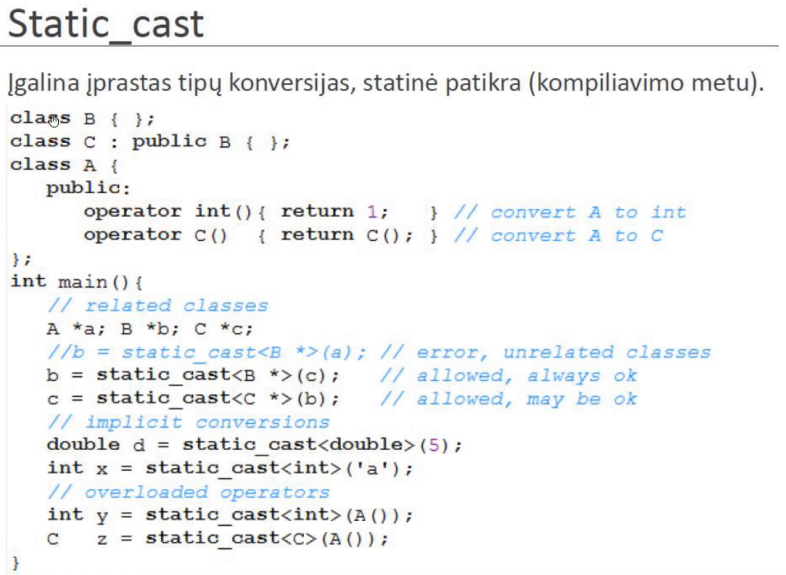

# Lecture 10 - Polymorphism

OOP is based around these 4 ideas:
- Abstraction - abstract classes.
- Encapsulation - objects are independent and work well on their own (setters, getters, every field is private, etc..).
- Polymorphism - many forms. The same thing (method contract, object) different implementation.
    * ad-hoc (overloading)
    * parametrical pomlymorphism - generic templates.
    * subtype polymorphism - dynamical linking (virtual)
    * interfaces
- Inheritance - class inheritance.

`B b_val = d_val;` - Will use a copy contstructor!
You should catch exceptions by reference. Because copying exception is weird...

Dynamic polymorphism is achieved with keyword **virtual**.
bp->f(); will call base class, unless the f() method in the base class is said to be virtual.
virtual keyword is inherited, adding it again wont change anything.
When you make a method virtual everytime you construct a new object, it will have an additional hidden field that is a pointer to that method, so when you define a call to that function in code, it actually looks at that pointer variable, and calls the function that it points to. So when you make a method virtual even the base class has to have this hidden variable.
Table of virtual functions:
[virtual_method_1_ptr, virtual_method_2_ptr, virtual_method_3_ptr...]

Pass by value will not have any polymorphism!
This is subtype polymorphism:

.

This is bad, because we loose base class contract. (Good use case: creating a stack class out of deque, we would need to limit and create new methods).

