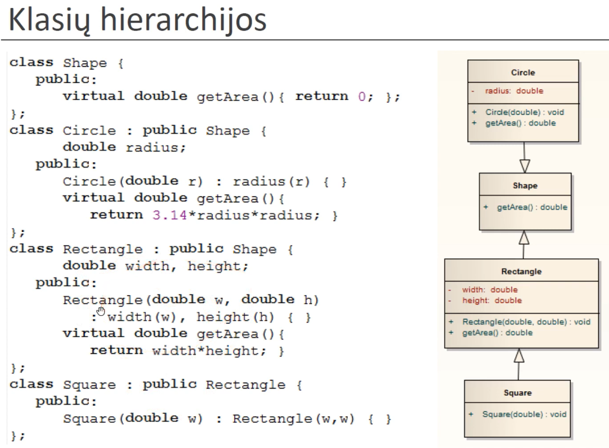
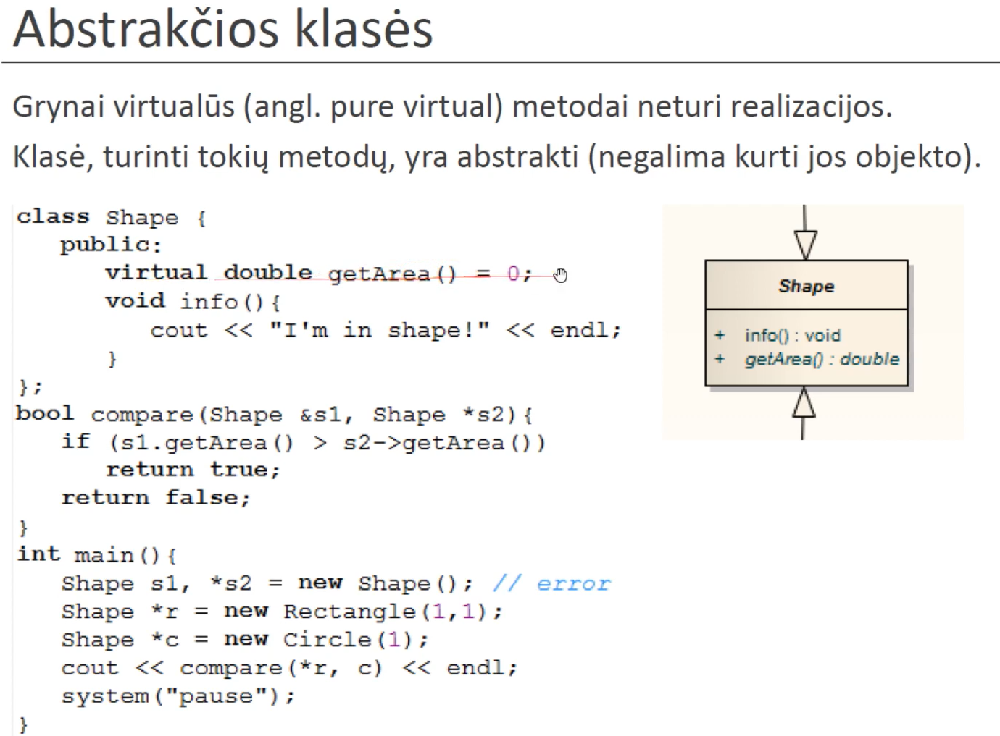
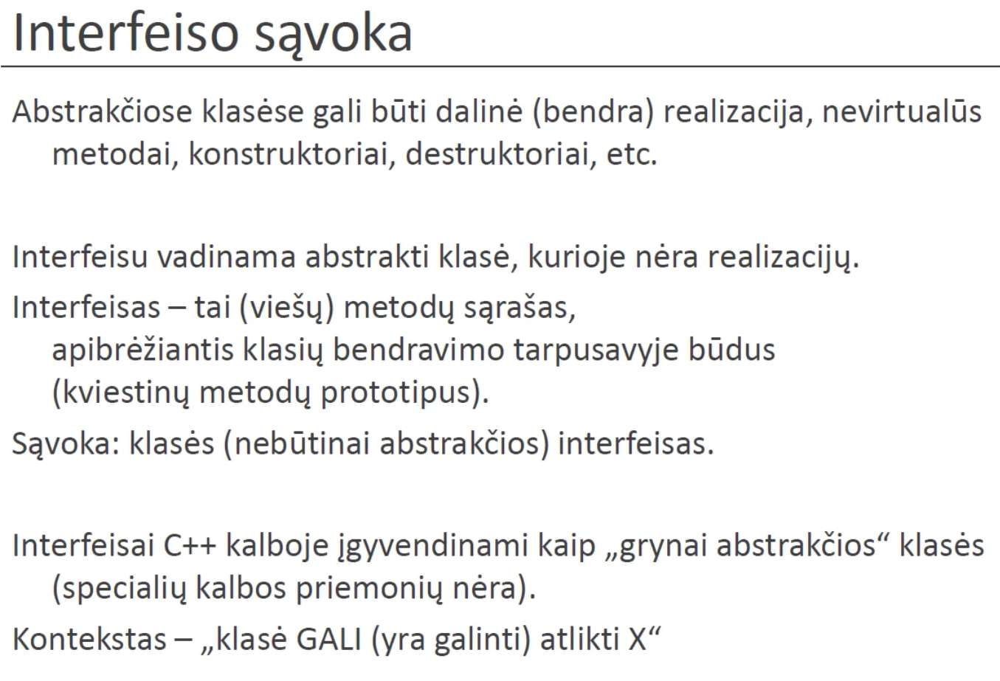
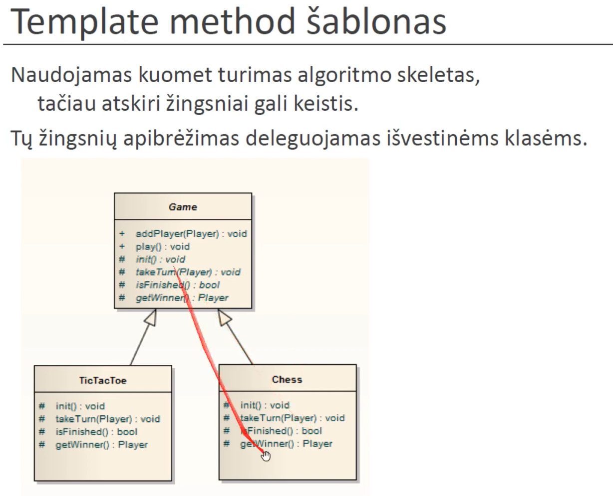
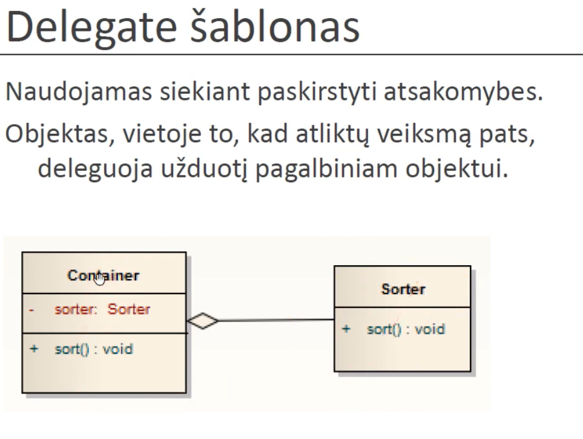
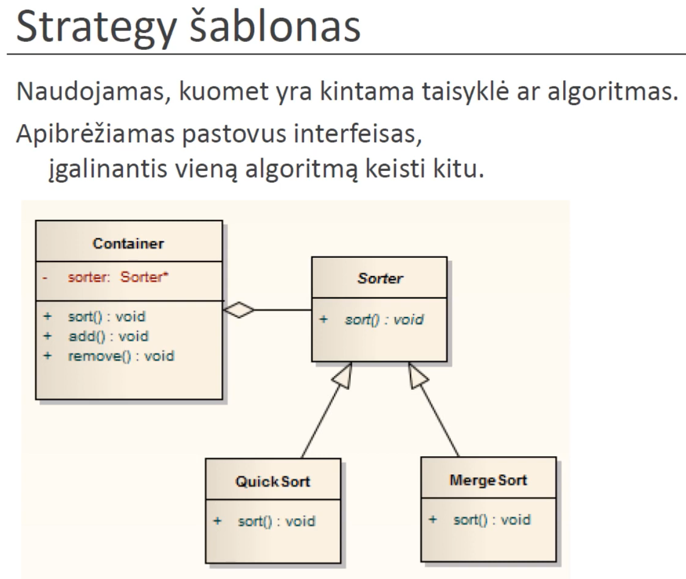
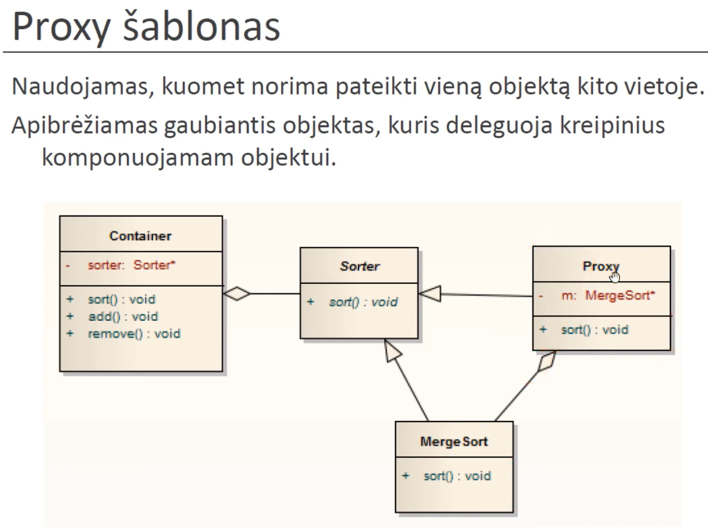
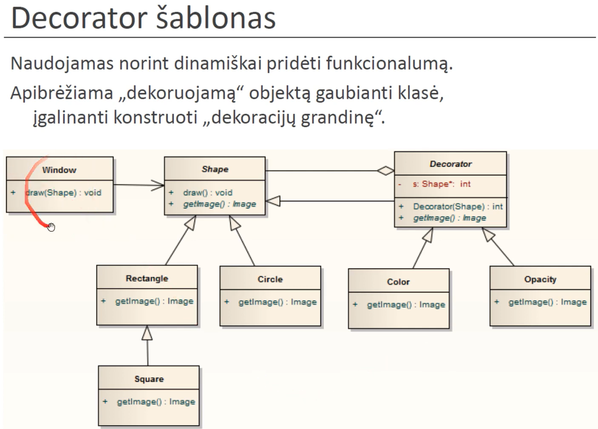

# Lecture 11 - Abstract Classes

Encapsulation - connect data and operations into one thing.

Square -> Rectangle might be bad, because Square is a Child class that is capabale of less things than Rectangle. (Eventhough in natural language we say square is a rectangle that has equal width & height).

pure virtual method is defined: ` = 0;`.

in c++ an interface is a class that only has pure virtual methods.

