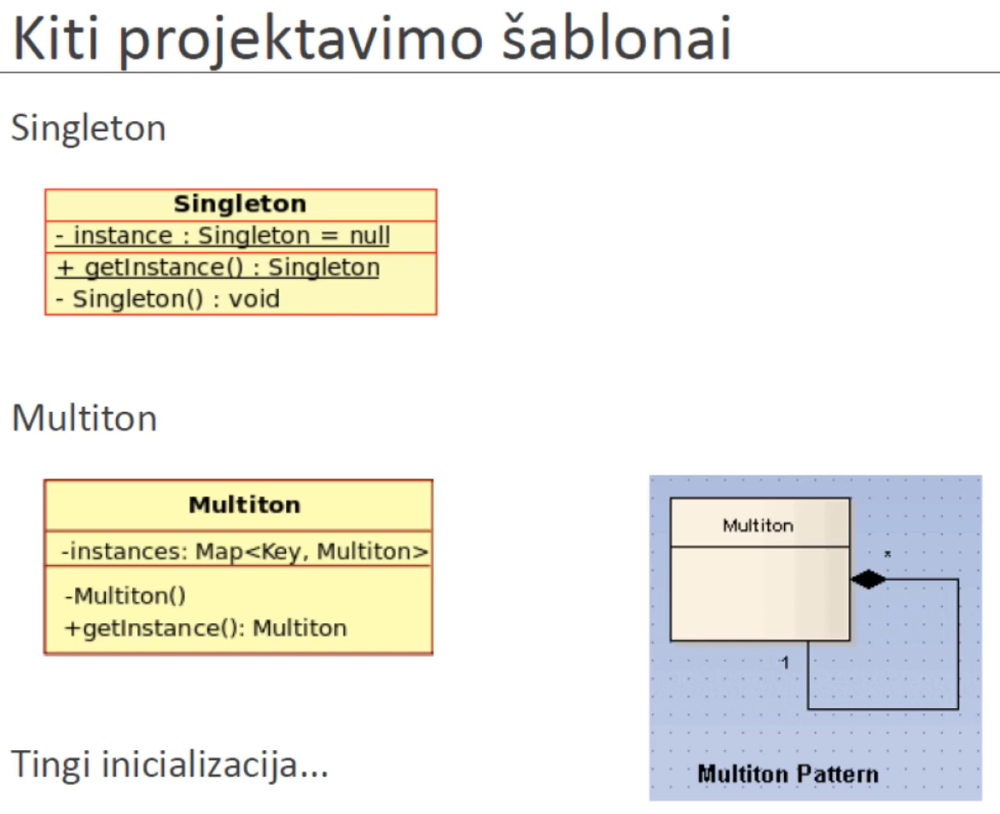

# Lecture 12 - Object Creation

Constructors are called starting with base class ending with most derived class.
Destructors are called starting with most derived class, ending with base class.

It is important to make your destructor methods virtual if there will be classes that inherit, otherwise if you view Derived class as Base class, then the the base class constructor will get called and it won't call the derived constructor.

Virtual Constructors don't exist.

When an exception happens during destructor, the subobject destructors are still called.

RAII - resource aquisition is initialization. Always when you use `new` you should assign it to some variable that gets destroyed at the end of the block and you should never use delete??

To get a strong exception safety, before setting something in the object, first create a copy of the object, do the operations there and if no exceptions occur there do these operations on the actuall object.

