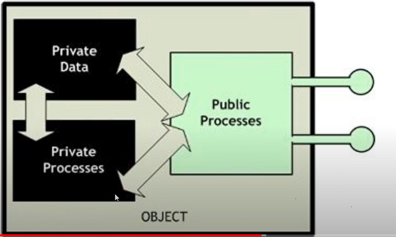
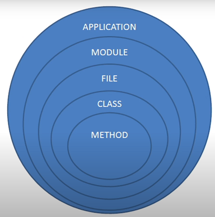
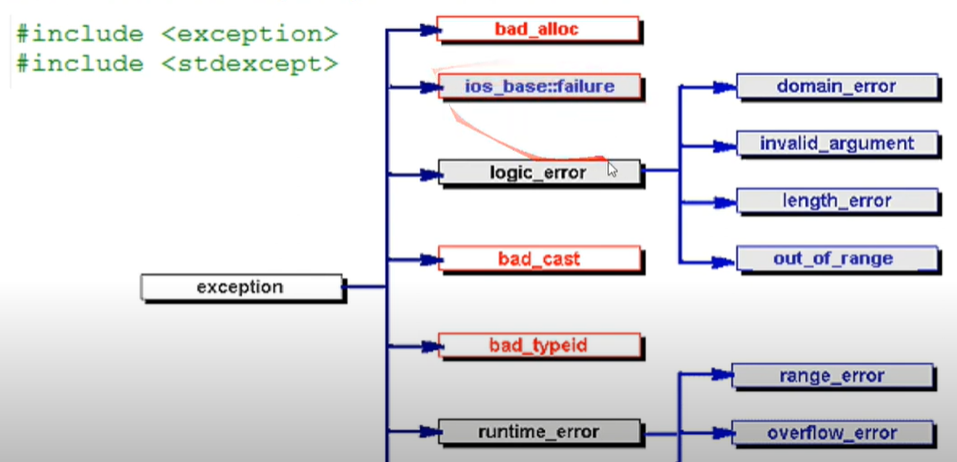

# Lectures 2 & 3

Lectures: https://www.youtube.com/playlist?list=PLA7athEO665B5tSw4fMbogoWpkZHlIXx3

## Programming Paradigms
- structural - any program can be written in a series of commands, flow control statments and loops.
- procedural - you view software as a collection of procedures that are executed in some order.
- modular - code should be written not as programs, but as modules that can be reused for different tasks (libraries).
- object oriented - you view software as a list of some objects that communicate with one another.
- generic - type of programming that lets you write code without knowing the data types you are working with.


## Classes & Objects

### Data types
- **Primitive** - int, bool, float, ...
- **Derived** - array, struct, classes, ...

```cpp
struct ExampleStruct {
    // struct members
};

class ExampleClass {
    // class members
};

int main() {
    struct ExampleStruct es1;
    ExampleStruct es2;
    ExampleClass es3;
}
```

#### Variables
- global
- local
- structure/class variables - fields

#### Functions
- global
- local functions **are NOT part of c++**
- structure/class functions - methods

```cpp
int globalVariable;

int globalFunction (){
    return 5;
}

struct ExampleStruct {
    int objectField;

    int memberFunction() { // method or (member function)
        return 5;
    }
}

int main() {
    globalVariable = 1;
    globalFunction();
    {
        ExampleStruct es;
        es.objectField = es.memberFunction();
    }
    // es is out of scope here
}
```

### OOP
- objects in software resemble abstract real world objects, only taking the qualities of the object that are relevant.
- combine class fields with methods.
- SRP - single responsibility principle (class student should not have a method print(), it should have a method toString()).

### Visibilty Control
Encapsulation - reduces the chance of errors and enhance resistance to changes. In OOP **all fields should be private**, all interactions (reading, writing) should only be done using methods. For simple variables you can use get & set pattern:

- `get_variable() { return variable; }`
- `set_variable(int variable) { this->variable = variable; }`

You should use this pattern even if these methods dont add any extra functionality. Because incase your program needs to change in the future it will be very easy to add some extra functionality/validation, etc..



```cpp
struct Student {
    private:
        int a;
        void f() {

        }
    public:
        int b;
        void g() {

        }
    private:
        int c;
}
```

#### Struct vs Class
The only difference between a class and a struct is that by default all struct fields are public and all class fields are private. In every other sense they are the same.

### Object Life Cycle
- Object creation in the memory.
- Object fields initialization.
- Use object in the code.
- Object destruction.
```cpp
class Example {
};

int main () {
    {
        Example e; // object created
    }              // object destroyed
    Example *e = new Example(); // object created
    delete e;                   // object destroyed
}
```

```cpp
class Example {
        int *data;
    public:
        Example() {
            data = new int[10]
            cout << "Created!" << endl;
        }
        ~Example() {
            delete data;
            cout << "Deleted!" << endl;
        }
}
int main() {
    Example e;
    system("pause");
}
```
**Output:**
```
Created!
Press any key to continue...
Deleted!
```
Constructors and destructors supplement the getter and setter methods and ensure that object is in a valid state from creation till destruction.

### UML Class Diagram
- name
- fields (visibility, name, type)
- methods (visibility, name, parameters, return value)

You can tell a lot about the behaviour of the class just by looking at these things and not diving into implementation.

### Static Elements
Static elements are initialized when the program starts and live till the end of the program.
- Static fields - are shared between all objects of that class.
- Static methods can only use static fields.
```cpp
class Example {
        static int count; // By default its initialized to 0
        Example(){
            count++;
        }
}
```

## Multi-file Programs
The idea behind this picture is to handle changes. Small changes require to only change one method, bigger changes might change the whole class or file, even bigger changes, if for example our input and output type changes from .txt to .csv then we would need to change the whole module. SRP principle applies to all of these.



- Unit tests: methods, classes.
- Integration tests: application level functionality.

### Header Files
- reduces compilation times, using header files allows to only recompile parts of the code that changed, while `#including ".cpp"` files, imports all of the implementation code.
- helps avoid multiple definition error - entity can only have one definition.
- information hiding - allows you to hide the implementation and have it only in a compiled .o file.
- documentation - serves a similar purpose as uml class diagram.

* `.h` - is for declaration of procedures, classes, namespaces.
* `.cpp` - is for implementation. In this file you should implment what you declared in your header file.

#### `Example.h`
```cpp
// file "Example.h"
#ifndef EXAMPLE_H
#define EXAMPLE_H

const int MY_CONSTANT = 13;

void myFunction();

class MyClass() {
    public:
        MyClass();
        void doSomething();
}

#endif
```
Here EXAMPLE_H is a unique identifier, if in another file you include two files that define EXAMPLE_H, the second one would be skipped.

#### `Example.cpp`
```cpp
// file "Example.cpp"
#include "Example.h"

myFunction(){
    cout << "Hello World!";
}
MyClass::MyClass() {
    cout << "Constructing MyClass.";
}
void MyClass::doSomething() {
    cout << "Loading...";
}
void doSomething() { // This procedure is not defined in the Example.h file!
    cout << "Something..";
}
```

#### Why not just include `.cpp` files?
When you include a file in c++, the contents of the include file basically get copied over before compilation. If you included .cpp files, you would only need to compile the main.cpp, because all of the other files would just get coppied over. But there are many problems that come with this:
- Everytime you change something in main or in any other .cpp file that you include, you would have to essentially recompile the whole code, because all of your code is in one file (its all included in one file, so the only file you compile is main).
- No code is hidden, if you include .cpp files, there is no way to hide an implementation of a module or library. If you wanted to include .cpp you would need to have access to all of the implmentation.

**Note**: c++ allows multipile definitions, but only single implementation.

### Name Spaces
`namespace` - is a way to group code with a prefix. Namespace is nothing more than a prefix, that you have to use everytime you want to access that part of the code.
```cpp
int z; // global namespace.

namespace One {
    int x, y;
}
namespace Two {
    int x, y;
}
namespace { // anonymous namespace - only accessible inside the file its defined.
    int a, b;
}
int main() {
    z = 5;
    One::x = 3; // scope resolution operator.
    Two::x = 4;
    a = 4;
    {
        using namespace One; // after using statement I dont need to use One::, till the end of the block.
        using Two::x;
        y = 15; // One::y
        x = 5; // Two::x
    }
}
```
#### Important notes:
- scope resolution operator - `::`.
- global namespace - is accessible without `::`, everything that is not in `namespace <name> {}`, is considered to be in the global namespace.
- anonymous namespace - `namespace {}` - is also accessible without `::`, but it is not accessible outside of the file that it is defined.
- `using namespace <name>;` - allows you to access that namespace without using `<name>::` inside the code block `{}` it is written.
- A class is also a name space, you can use `::` operator to access its static members, and implement methods.
- You can define the same namespace multiple times accross multiple files. When you `#include` two files with the same namespace, they will just share the same namespace. The only important thing is that there is no element that is of the same namespace name and same signature. So if you included two files with the same namespace that both have `sameNameFunction()`, you would get an error.
- One big problem with c++ namespaces: in case two libraries use identical namespaces, there is no good way to differentiate between them or solve this conflict.

```cpp
namespace One {
    class A {
        // First version
    };
    class B {
        // First version
    };
}
namespace Two {
    class A {
        // Second version
    };
    using One::B;
}

namespace Current = Two; // Change this line only to change the version.

int main () {
    B b; // First version
    A a; // Second version
}
```

### How All File Management Comes Together
Consider you are making a `Math` library. With two components: `Calculus`, `Geometry`. How do you structure your code?

#### Define Directory Structure
```
mathLib/
│+
│
├── calculus/
│   ├── Calculus.h
│   ├── Integral.cpp
│   ├── Integral.h
│   ├── Derivative.cpp
│   └── Derivative.h
│
├── geometry/
│   ├── Geometry.h
│   ├── Triangle.cpp
│   ├── Triangle.h
│   └── Circle.cpp
│   └── Circle.h
└── Math.h (central include file)
```
#### Define Namespace Hierachy
- Top level namespace: `math`
- Sub level namespaces: `calculus`, `geometry`

#### Define Header Files
##### `Math.h`
```cpp
#include "geometry/Geometry.h"
#include "calculus/Calculus.h"
```
##### `Calculus.h`
```cpp
#include "Integral.h"
#include "Derivative.h"
```
##### `Geometry.h`
```cpp
#include "Triangle.h"
#include "Circle.h"
```

#### Triangle Example

##### `Triangle.h`
```cpp
// file "Triangle.h"
#ifndef TRIANGLE_H
#define TRIANGLE_H

namespace math {
    namespace geometry {
        class Triangle {
            private:
                float a, b, c;
            public:
                Triangle(float a, float b, float c);
                ~Triangle();
                float length();
        };
    }
}

#endif
```

##### `Triangle.cpp`
```cpp
// file "Triangle.cpp"
#include "Triangle.h"

namespace math {
    namespace geometry {
        Triangle::Triangle(float a, float b, float c) {
            this->a = a;
            this->b = b;
            this->c = c;
        }
        Triangle::~Triangle(){

        }
        float Triangle::length(){
            return a + b + c;
        }
    }
}
```

#### Use In Main
```cpp
#include "Math.h"

int main() {
    Math::Geometry::Triangle myTriangle1(2, 5, 7);

    // using statement
    using namespace Math::Geometry;
    Triangle myTriangle2(1, 1, 1);
}
```

### Building Multi-file Programs
#### Script Build Automation
The most primitive way to automate the build process for a multi-file c++ program, would be to use a CLI script, such as the windows `.ps1`.
```ps1
# To run this powershell script: ./build.ps1
g++ -c -std=c++20 .\A.cpp .\B.cpp
g++ -std=c++20 A.o B.o
```
However, using this method we compile all of the codebase everytime, even the files that didn`t change. Also this method doesn't offer much flexibility, for example if I wanted to add a different flag, I would have to change every single command, which in a big project could be a lot.

To efficiently build a multi-file c++ program, we will need to use a **build system**. Build system helps you with:
- Automate the compilation and linking of source files into excecutables.
- Recompile only the changed portion of the source code.
- Make maintaining the build system easier, with variables and other constructs.

#### Make
Automating the build process for c++ is usually done using **make** tools, that typicaly come with `MinGW-w64`. The build is done using **build rules**:
- **Target** - is the name of an executable or an object file that this rule is trying to make.
- **Prerequisites** - the names of object or cpp files that are needed to make the target. For the prerequisites that are not created or need to be recompiled (due to change) make looks for rules that can make the missing prerequisite and executes it.
- **Recipe** - build commands that are used to build the target if all prerequisites are made and unchanged.
```makefile
target: prerequisites
    recipe

program.exe: main.o math.o
    g++ -std=c++20 main.o math.o -o program.exe
```

You can also define variables, that are just pieces of text which you can reuse in your rules:
```makefile
COMPILER=g++
CFLAGS=-std=c++20

CFILES=main.cpp mathLib.cpp
OBJECTS=main.o mathLib.o
EXECUTABLE=program.exe

$(EXECUTABLE):$(OBJECTS)
    $(COMPILER) $(CFLAGS) $(OBJECTS)
```

- By default, when you run `make` it runs the first rule in the `makefile`, you can also specify the rule you want to run `make <rule_name>`.
- By convention every makefile has **all** rule that builds the executable and all binaries. and **clean** rule.
- By convention every makefile has **clean** rule that deletes the executable and all generated binaries.

##### Make Variables & Functions
- `$@` - used in recipe: copies whatever is on the left side of the rule.
- `$^` - used in recipe: copies whatever is on the right side of the rule.
- `%` - symbol is used in pattern rules, the `%` symbol matches any target text and then can be used in the prerequisites. Example: `%.o:%.c`
- foreach - is used to iterate over a list of space separated strings. `$(foreach variable,$(STRING_LIST),output)`
- `$(wildcard <pattern>)` - finds names of files that match a shell file-name pattern (similar to regex) in the current directory. Example `$(wildcard *.c)` - will return all c files.
- `$(dir <file_path>)` - extracts the directory path from file path.
- `$(notdir src/main.cpp src/utils/helper.c)` - extracts the file name.
- `$(basename src/main.cpp src/utils/helper.c)` - removes the sufix.
- `$(patsubst %.cpp(pattern),%.o(replacement), $(SOURCES))` - substitutes the text in all source strings.
- `$(subst find,replace,text)` - find and replace.
- `$(addprefix src/, file1.c file2.c)`- adds a string to the start of each string.
- `$(addsuffix .o, main integral derivative)` - adds a string to the end of each string.

##### Makefile example
This makefile automatically compiles all .cpp files in `SRC_DIR` and puts them inside `BIN_DIR`.
```makefile
# This makefile doesnt allow make to track changes in header files!
COMPILER := g++
SRC_DIR := src
BIN_DIR := bin
TARGET := $(BIN_DIR)/program.exe


# Function to recursively find all directories under a given directory
rwildcard=$(foreach d,$(wildcard $1*),$(call rwildcard,$d/,$2) $(filter $(subst *,%,$2),$d))
SOURCES := $(call rwildcard,$(SRC_DIR)/,*.cpp)
OBJECTS = $(subst .cpp,.o,$(addprefix $(BIN_DIR)/, $(SOURCES)))

all: $(TARGET)

$(TARGET): $(OBJECTS)
	$(COMPILER) $^ -o $@

$(BIN_DIR)/%.o:%.cpp
	if not exist "$(@D)" mkdir "$(@D)"
	$(COMPILER) -c $< -o $@

clean:
	rmdir /s /q $(BIN_DIR)

.PHONY: clean
```

### Errors
- User errors - mis-use of the application.
- Programmer errors - application doesnt behave the way that its expected, is prone to user errors, etc..

#### Assert
- `assert(true)` - nothing will happen.
- `assert(false)` - prints error message, raises an exception.

Assert is used to inform about programmer errors:
```cpp
#include <cassert>
if (i % 2 == 0) {
    //..
}
else {
    assert(i % 2 == 1); // Might fail if i was < 0
}

for () {
    if ()
        return;
}
// Should be unreachable
assert(false);
```
When you make some sort of assumption about the code or a variable, its a good idea to put that assumption into an assert. `assert(my_object != nullptr)`.

Asserts can be turned off with `#define NDEBUG`. Intermediate program outputs for testing:
```cpp
#ifdef DEBUG
    cout << "my_var: " << my_var << endl;
#endif
#ifndef NDEBUG
    cout << "my_var: " << my_var << endl;
#endif
```

#### Exceptions
Separate 'normal code' from error handling.

Throw exception:
```cpp
throw 10;
throw "klaida";
throw Object(1, "param2");
```

Catch exception:
```cpp
try {
    // code that may throw exceptions
}
catch(int i) {
    cout << "int caught" << endl;
}
catch(Object o) {
    cout << "Object caught" << endl;
}
catch(...) {
    cout << "Default catch" << endl;
}
```

##### Standard Exceptions
Each error type, has a corresponding exception type and we catch exceptions based on those standard types. All exceptions should be derived from the base `Exception` class. Then the by catching the base class you can catch all the classes that inherit.



Code with the mindset that an exception can be thrown at any moment. Use c++11 smart pointers, that automatically delete when variable is out of scope. Another option is to write a handler class that allocates the memory in the constructor and deletes it in the destructor, in this way the destructor will get called automatically when the handler is out of scope.