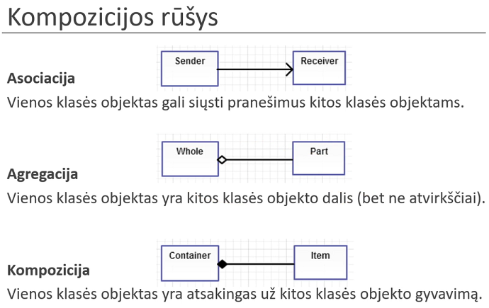
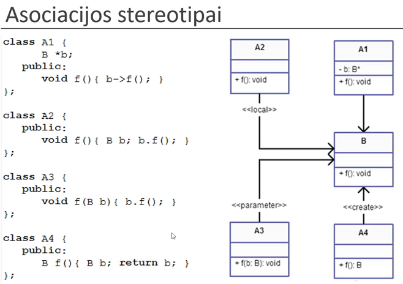
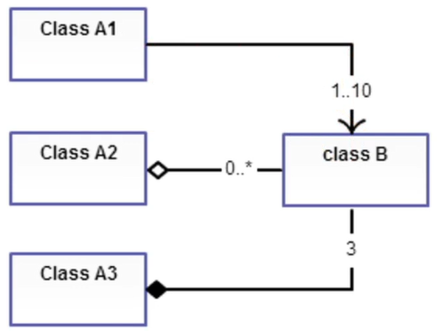
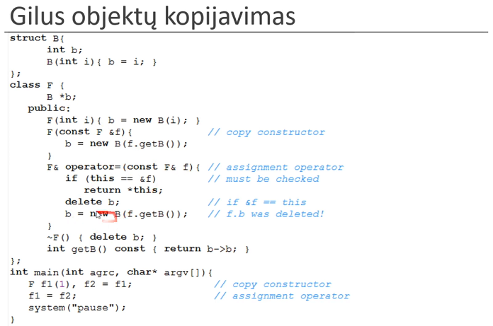

# Lecture 5

## Composition

Composition **!=** Inheritance

**Composite data type** - a data type that is made out of a combination of other data types.

```cpp
struct Example {
    int i;
    float f;
    char *s;
}
```

A class can be combined out of other classes:
```cpp
class Example {
    Object o1, o2;
    Object *o3;
    Example *e; // A recursive reference, used in data structures like: stack, que..
}
```

- Association - one class object can send messages to other class (call procedures): Sender **->** Receiver. 
- Agregation - one class object is part of another class object: Whole **<-** Part.
- Composition - one class object is responsible for the lifetime of another class object: Container **<-** Item.

Composition > Agregation > Association

**Agregation should be only one way** - if A has B, B should not be invoking A methods, because this entangles the objects and now in order to consider B I will have to consider A as well. This also applies to all objects that B aggregates, they also shouldnt be invoking A. Object B shouldnt even know that A exists.

**UML**



**Assoction Types UML**



**Aggregation & Composition**


**Intervals**



**Deep Copy**



Everything should be saved in stack, unless there is a need (the object is big).