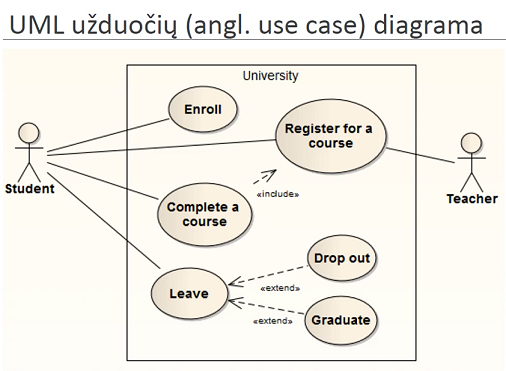
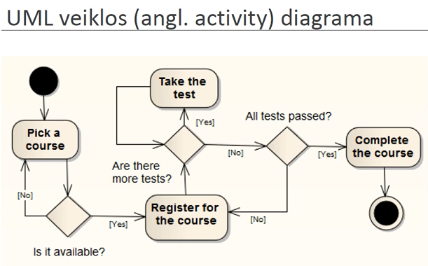
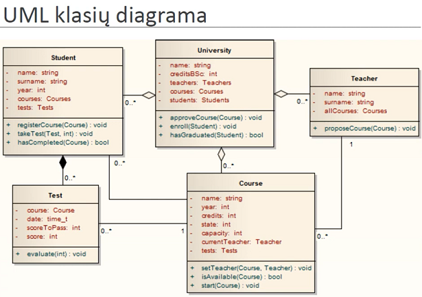
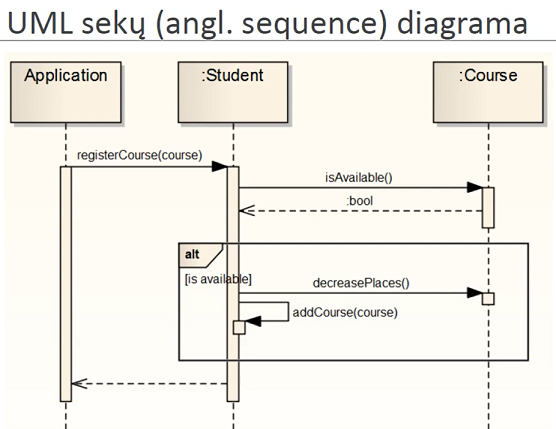
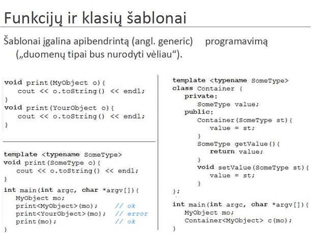

# Lecture 6

## Object Oriented Analysis

Analysis - dividing complex things into small pieces, in order to better understand the big picture through small pieces.

Synthesis - taking small things and trying to join them into one big thing.

OO analysis - problem domain division into classes/objects. Underlining nouns in a problem domain text helps. Verbs sometimes mean certain functionality/methods.

**Singleton** - object oriented programming approach to a global variable. (For configuration files, error handlers, etc..)

**UML** - unified modeling language.

Use Case - purpose is to ilustrate how the program is used.
- Include - means that one action requires the completion of another action it includes.
- Extend - allows for several different outcomes or sub actions of some action.

Activity diagram - explain a real life process.
- Black circle is the start.
- Tilted square - is a conditional statement.
- Other circle is the end.

Class diagram - a static diagram that captures all different objects and classes and their relations in the program.

Sequence diagram - captures the flow of procedure calls and class communication in code.

**Nested Classes** are classes defined in another class. This is usually done for composition. If they are declared public they can also be used outside of the outer class: `Outer::PublicInner`.

Preliminary declarations - are useful when two classes need each other.

Generic Class.

Big problem that comes with generic classes is that the .h and .cpp way of organizing your files becomes invalid. Because in order to generate generic class as an actuall class we need to know with what types it is used, so we cannot just compile the generic class. This is solved using .hpp files which contain declaration and part of implementation.
