# Lecture 7- Standard Template Library Containers

Containers - contain some objects inside.

Containers are either sequences or associative containers:
- Sequences: vector, list, deque. Element order depends on when & where elements are inserted.
- Associative Containers: set, multiset, map, multimap. (key-value pairs)

Sequences:
* Vector - a standard array, operations with the end are cheap, operations with the start are expensive.
* Deque - double ended queue, operations with start and end are cheap, operations with the middle are expensive. (Its implemented as two arrays that are split in the middle, if it becomes 'unbalanced', then the rebalancing operation takes place.)
* List - all elements are connected with pointers, this is not an array. Great for when you want to traverse the whole list from left<->right and do some modifications in place. (Adding an element in the middle or anywhere costs nothing).
Sequence adaptors:
- Stack
- Queue
- Priority Queue - ordered queue.

Adaptors just use the standard sequence types and limit some operations.

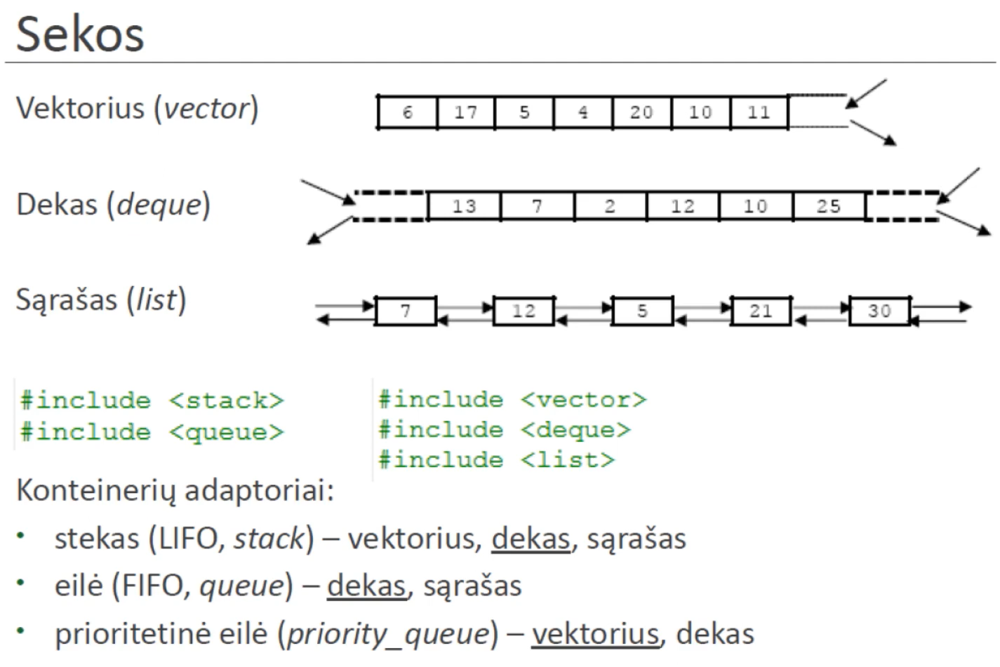

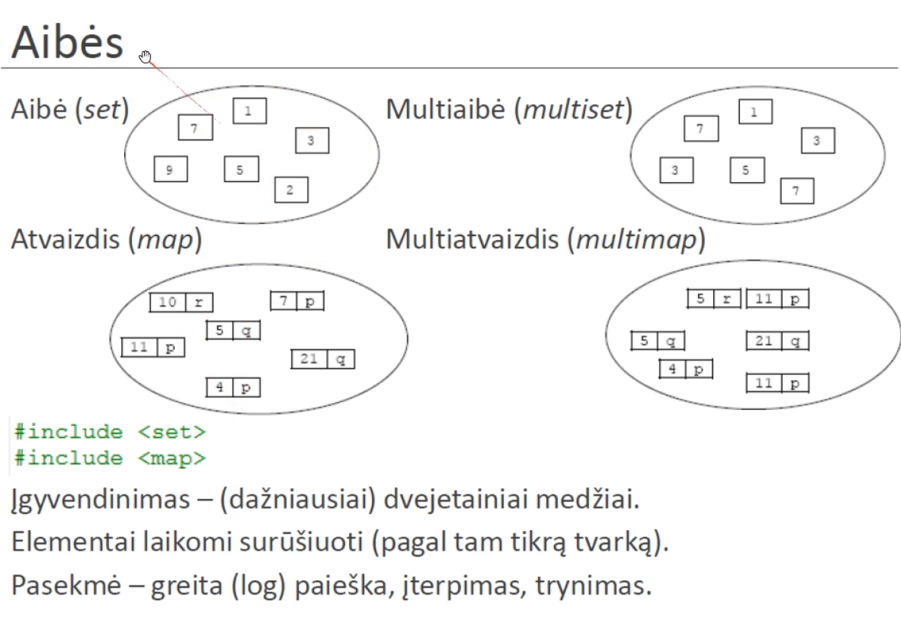

All cpp containers have an iterator.

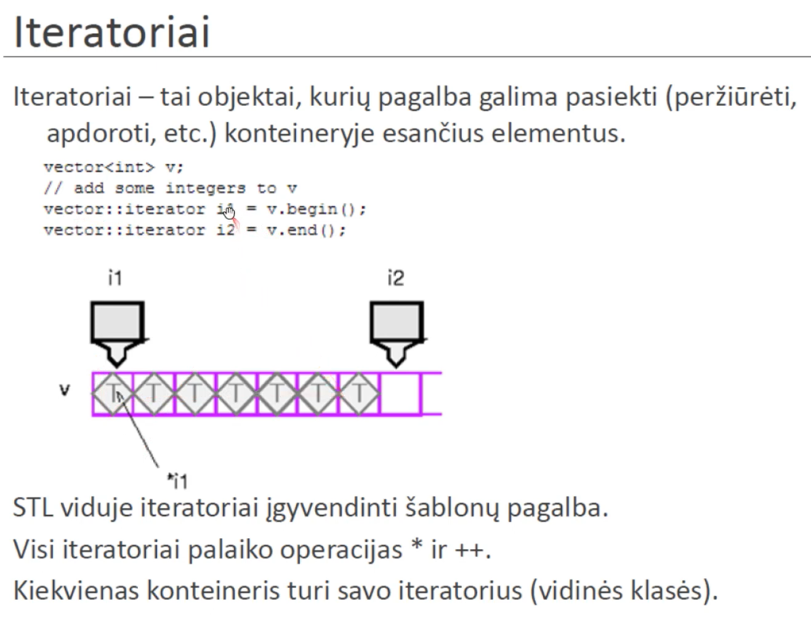

An iterator can be just a pointer.

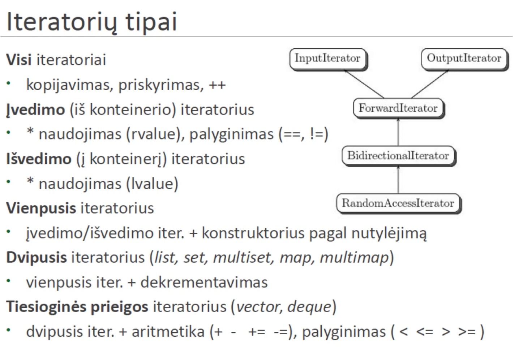

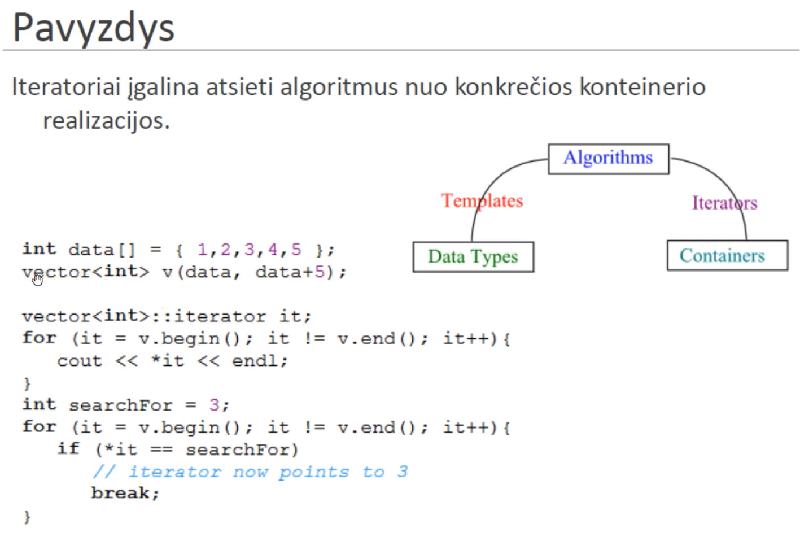

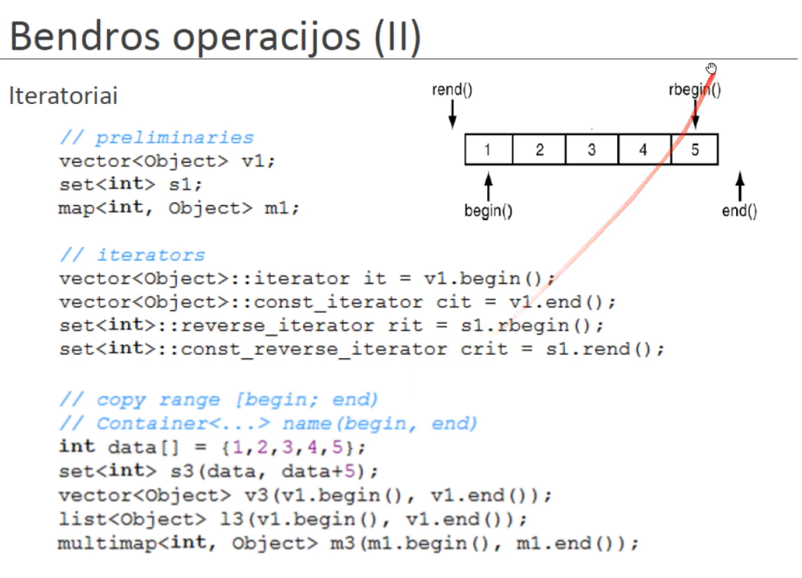

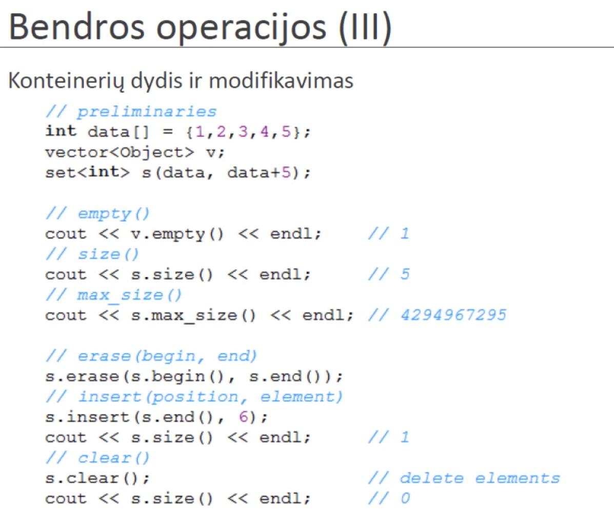

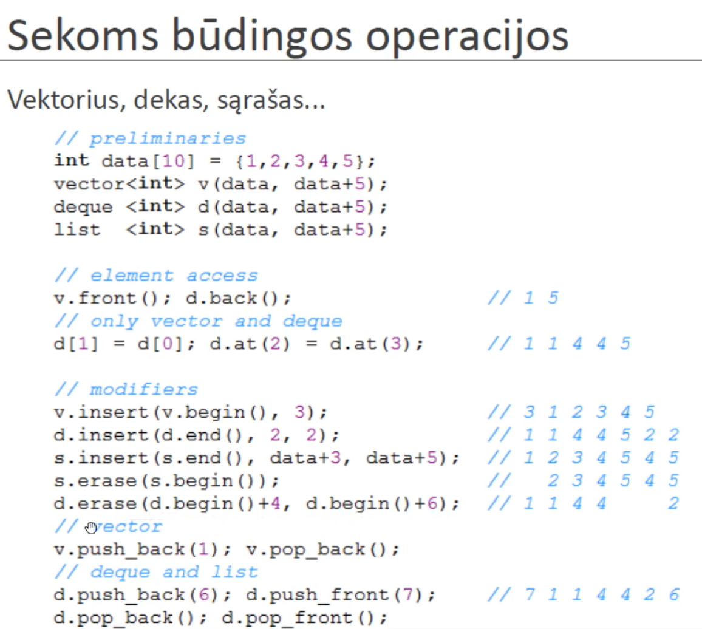

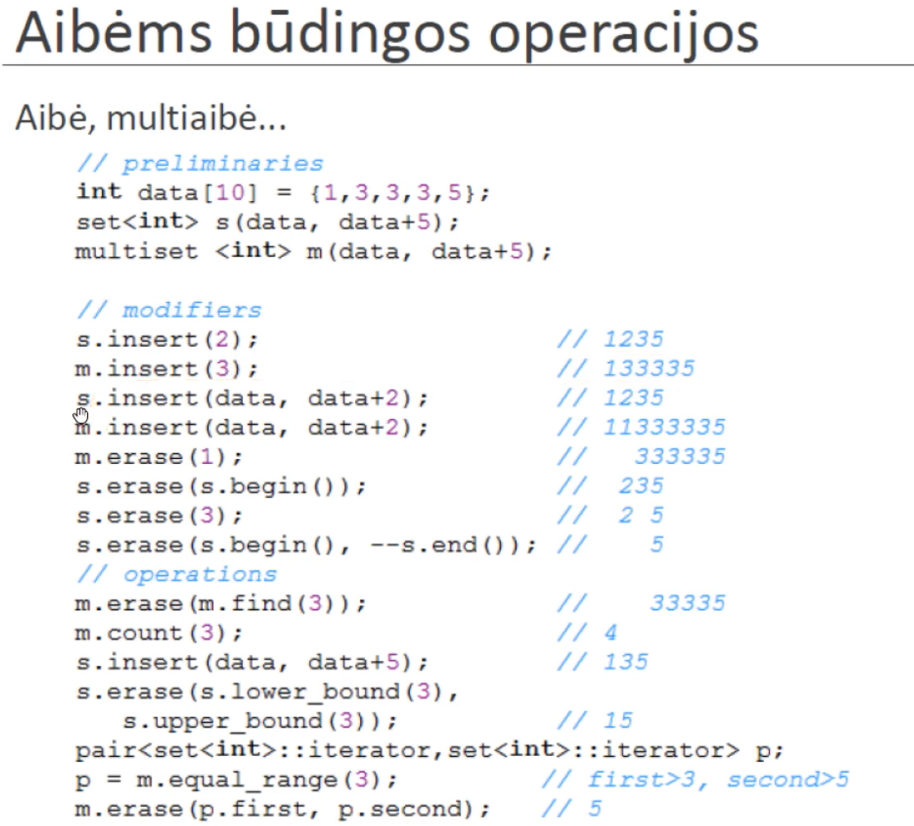

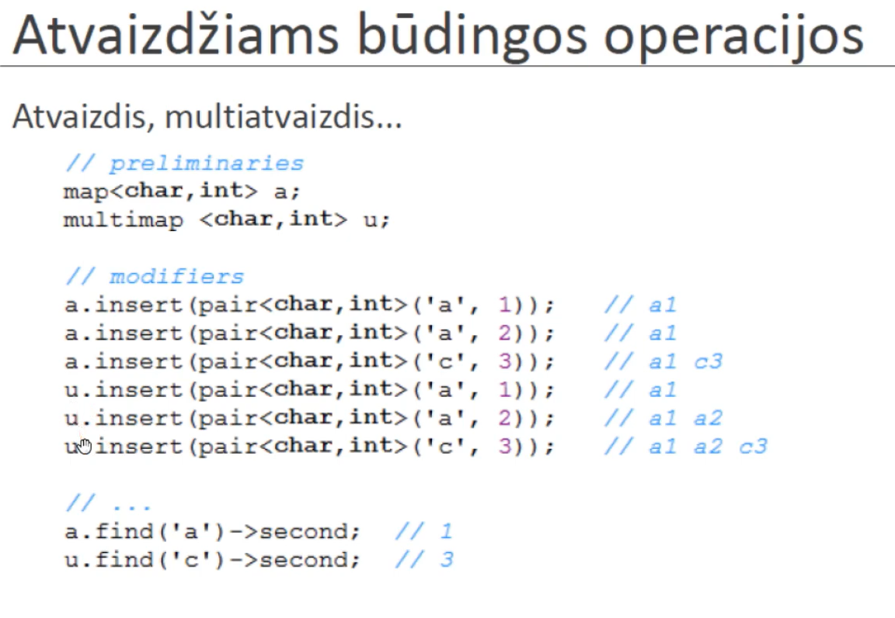

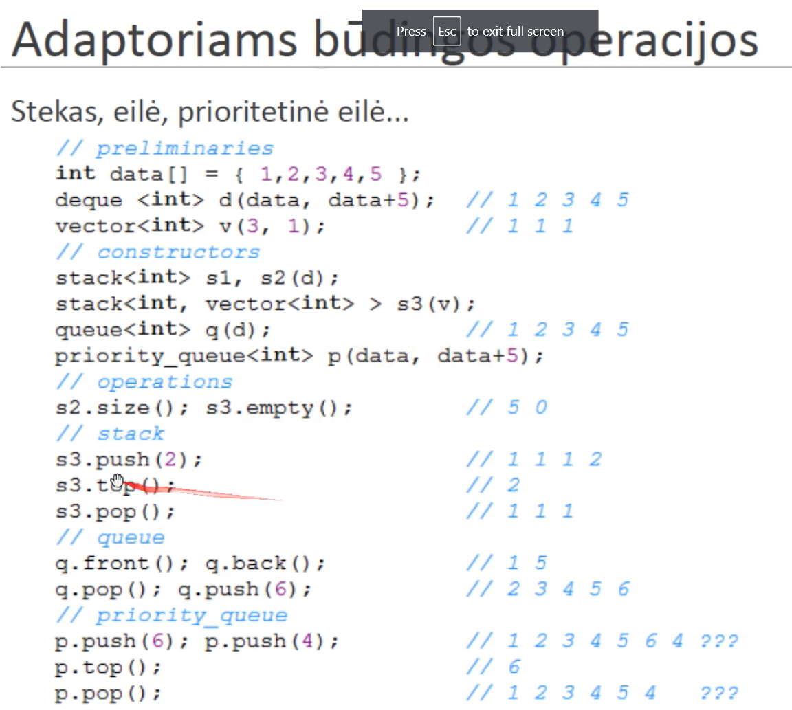
