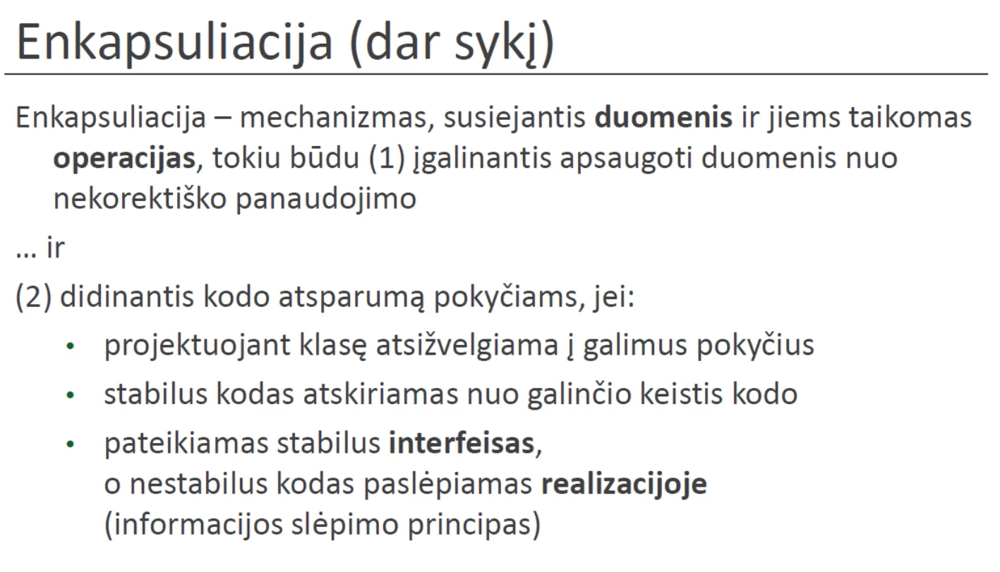
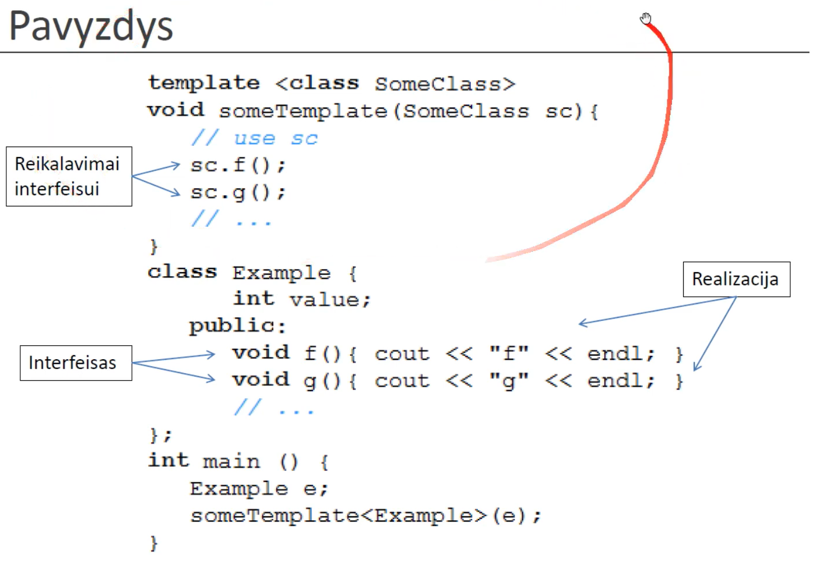
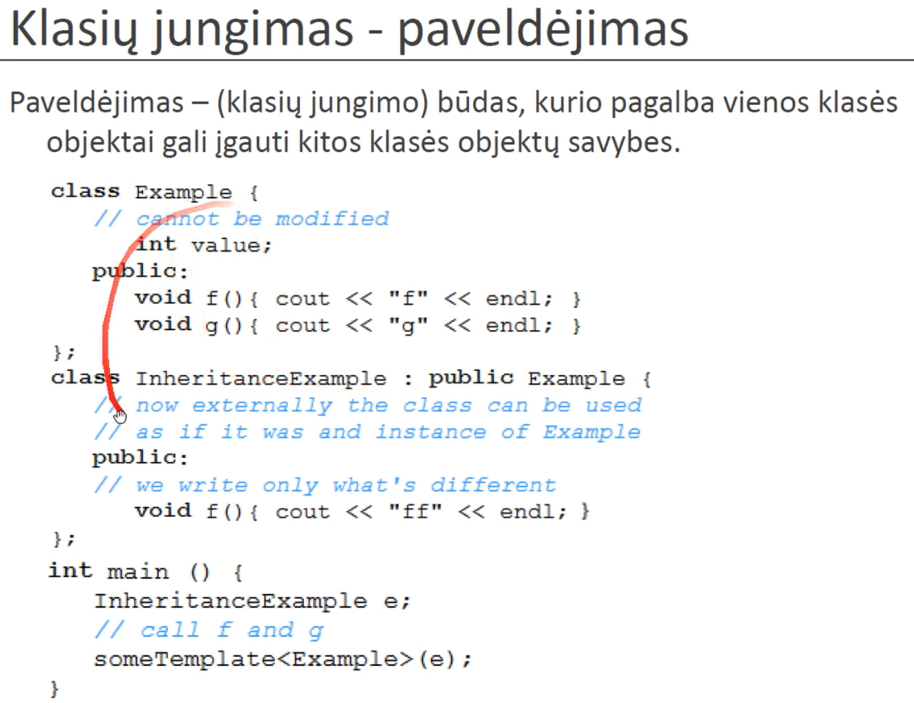
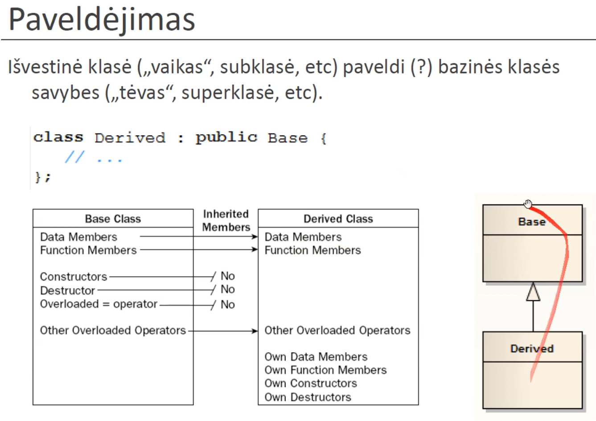
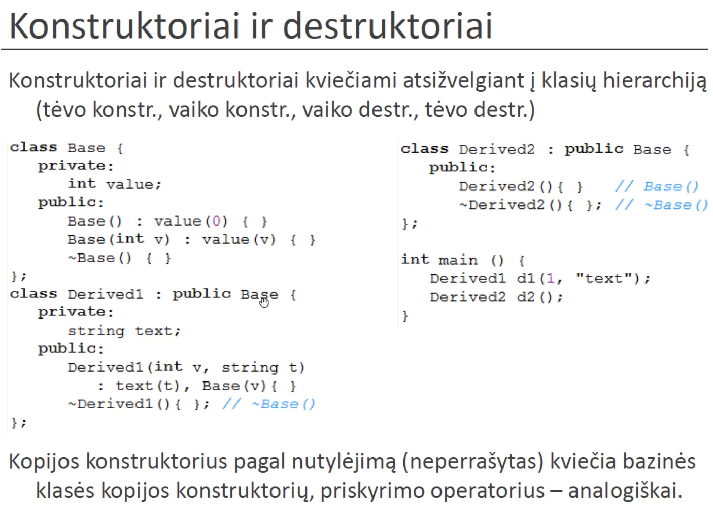
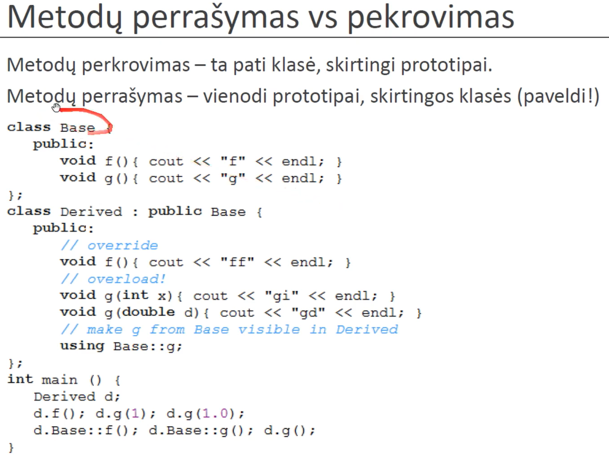

# Lecture 9 - Inheritance

Interface is a contract, it separates the implementation to a different class.
Interfaces are cool for:
- Decoupling code components - decoupling implementation details of a component from its usage. You can use an interface and have no idea about the implementation behind the scenes. This also allows to change implementation, for example ILogger can be implemented by two different classes: ConsoleLogger, DatabaseLogger. And the class that uses ILogger doesn't need to know which logger we are actually using. (Dependency Injection DI)
- Polymorphism - the ability of different objects to respond to the same message—or function call—in different ways. Interfaces are runtime polymorphism, you can have an array of interface, and the different objects behind will have different function calls. Common use case: game design - IUpdatable.
- Ensure compliance to contract.

Class that inherits from baseClass, also supports base class contract, meaning that you can use the Class as baseClass.

Composition: D has B.
Inheritance: D is B.

The derived class doesnt inherit base class private fields. Use protected for this.

OOP - is made for code control, code changes.